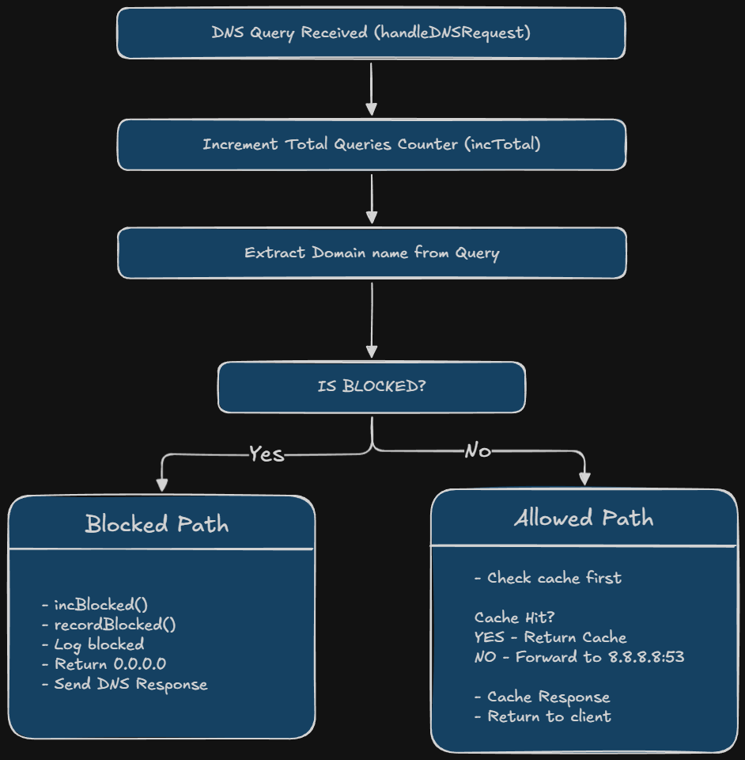

# DNS Ad-Blocker

A simple DNS-based ad blocker written in Go that blocks ad and tracking domains at the DNS level.

## How It Works

1. The application runs a DNS server on port 53
2. When a DNS query comes in, it checks if the domain is in the blocklist
3. If blocked: returns 0.0.0.0 (blocks the connection)
4. If allowed: forwards the query to Google DNS (8.8.8.8) and caches the result
5. Statistics are tracked and available via HTTP API

## Setup

### Prerequisites

- Go 1.25.2 or higher
- Administrator/root privileges (required for port 53)

### Installation

1. Navigate to the directory:

```
cd dns-ad-blocker-golang
```

2. Run the server with admin privileges:

**Windows (PowerShell as Administrator):**

```
go run .
```

**Linux/Mac:**

```
sudo go run .
```

### Configure System DNS

Set your system DNS to `127.0.0.1` to route all DNS queries through the ad blocker.

**Windows:**

- Open Network Connections (Win + R, type `ncpa.cpl`)
- Right-click your network adapter > Properties
- Select "Internet Protocol Version 4 (TCP/IPv4)" > Properties
- Choose "Use the following DNS server addresses"
- Set Preferred DNS: `127.0.0.1`
- Set Alternate DNS: `8.8.8.8`

**Linux:**

```
sudo echo "nameserver 127.0.0.1" > /etc/resolv.conf
```

**Mac:**

- System Preferences > Network
- Select your connection > Advanced > DNS
- Add `127.0.0.1` to DNS Servers

## Usage

### Add Blocked Domains

Edit `blocklist.txt` in the dns-ad-blocker directory:

```
0.0.0.0 ads.example.com
0.0.0.0 tracker.example.com
```

### View Statistics

The application provides two HTTP endpoints:

- **Overall stats:** http://localhost:8080/stats
- **Per-domain blocks:** http://localhost:8080/blocked

## Testing

Test if a blocked domain resolves to 0.0.0.0:

```
nslookup ads.google.com 127.0.0.1
```

Test if allowed domains work normally:

```
nslookup google.com 127.0.0.1
```

## Architecture



## Components

- **dns_forwarder.go** - Main DNS server logic
- **blocklist.go** - Loads and manages blocked domains
- **cache.go** - Caches DNS responses with TTL
- **stats.go** - Tracks query statistics
- **blocked_stats.go** - Tracks per-domain blocking frequency
- **dashboard.go** - HTTP API for monitoring
